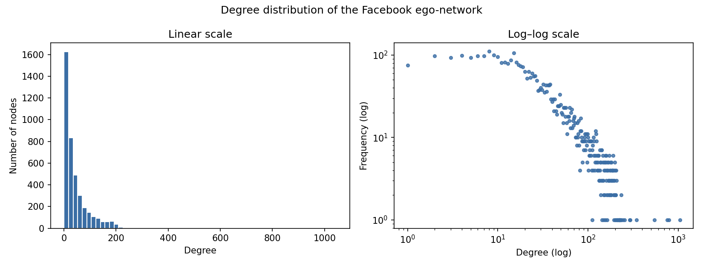
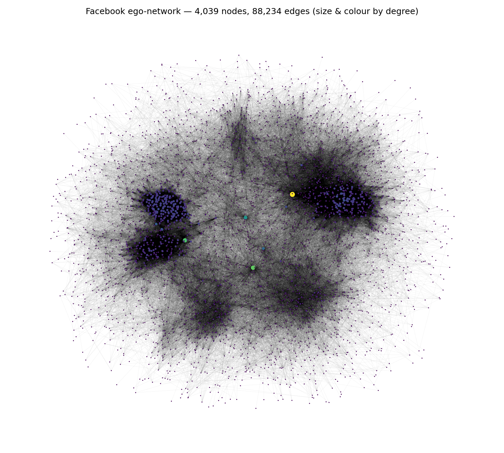
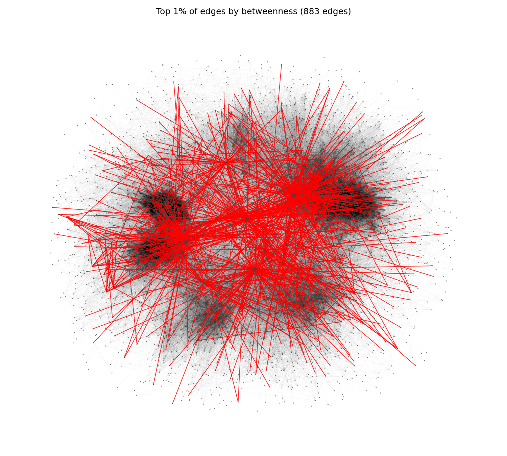
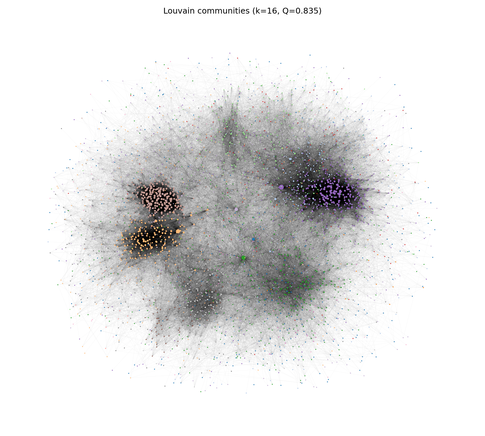
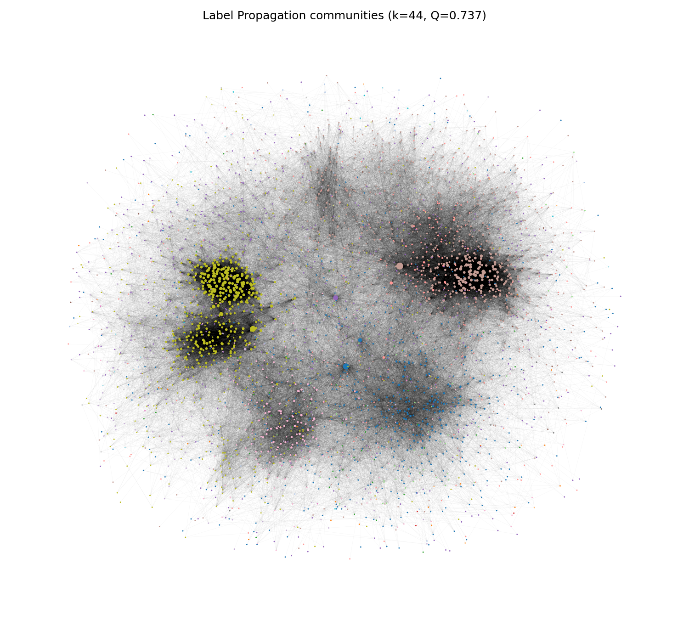

# Social Network Analysis of a Facebook ego-network

Structural analysis of a real social network: what holds it together, and how it breaks into
communities. The work builds the graph, describes its shape, finds the edges that bridge distinct
groups, and compares two community-detection algorithms.

MSc coursework, Big Data and Data Mining module, University of Hull.

---

## The problem

Real social networks are not random. They are sparse overall yet tightly knit locally, they hang
together on a few key connections, and they split into communities that mean something. This
project measures all three on the Stanford SNAP Facebook ego-network.

---

## Data

The Stanford SNAP `facebook_combined.txt` edge list (included in `data/`): 4,039 users and 88,234
undirected friendships, compiled from ten anonymised ego-networks. See
[`data/README.md`](data/README.md) for the source and citation.

---

## Method

- **Build and describe** the graph with NetworkX, reporting size, density, average degree,
  clustering, and connectedness.
- **Degree distribution** on linear and log-log scales to test for a heavy tail.
- **Edge betweenness centrality** (approximated with 400 sampled sources, since exact computation
  is expensive) to find the edges that lie on the most shortest paths, i.e. the bridges.
- **Community detection** with Louvain and Label Propagation, compared on modularity and on
  agreement (Normalised Mutual Information and Adjusted Rand Index).

---

## Results

**A small-world network.** 4,039 nodes, 88,234 edges, one connected component. Density is just
0.011 and the average degree is 43.7, yet the average clustering coefficient is 0.61. Low global
density with high local clustering is the small-world signature: a friend of a friend is usually
also a friend. The degree distribution is heavy-tailed, from a minimum of 1 to a maximum of 1,045.




**A few edges hold it together.** Almost every edge has near-zero betweenness because it sits
inside a dense cluster. A small number carry a large share of shortest paths. The top 1% of edges,
highlighted below, form the visible bridges between clusters, and all the top edges connect to the
main ego users.



**Two views of the same communities.** Louvain found 15 communities with a high modularity of
0.835. Label Propagation found 44 with a lower modularity of 0.737, mostly by splitting the larger
Louvain groups into smaller circles. The two agree strongly overall (NMI 0.81, ARI 0.61), which is
the expected picture: large friend groups made of smaller circles based on school, work or family.




---

## Repository structure

```
msc-social-network-analysis/
  notebooks/
    social_network_analysis.ipynb   graph stats, edge betweenness, community detection
  src/
    network_analysis.py   loading, statistics, betweenness, Louvain / Label Propagation, comparison
  reports/figures/   figures used above
  data/facebook_combined.txt   the SNAP edge list (included)
  requirements.txt
```

The notebook holds the full analysis; `src/` holds the reusable graph functions.

---

## Running it

```bash
python -m venv .venv && source .venv/bin/activate   # Windows: .venv\Scripts\activate
pip install -r requirements.txt
```

Then run `notebooks/social_network_analysis.ipynb`. The data is already in `data/`.

---

## Tools

Python, NetworkX, python-louvain, scikit-learn, pandas, NumPy, Matplotlib, seaborn.
